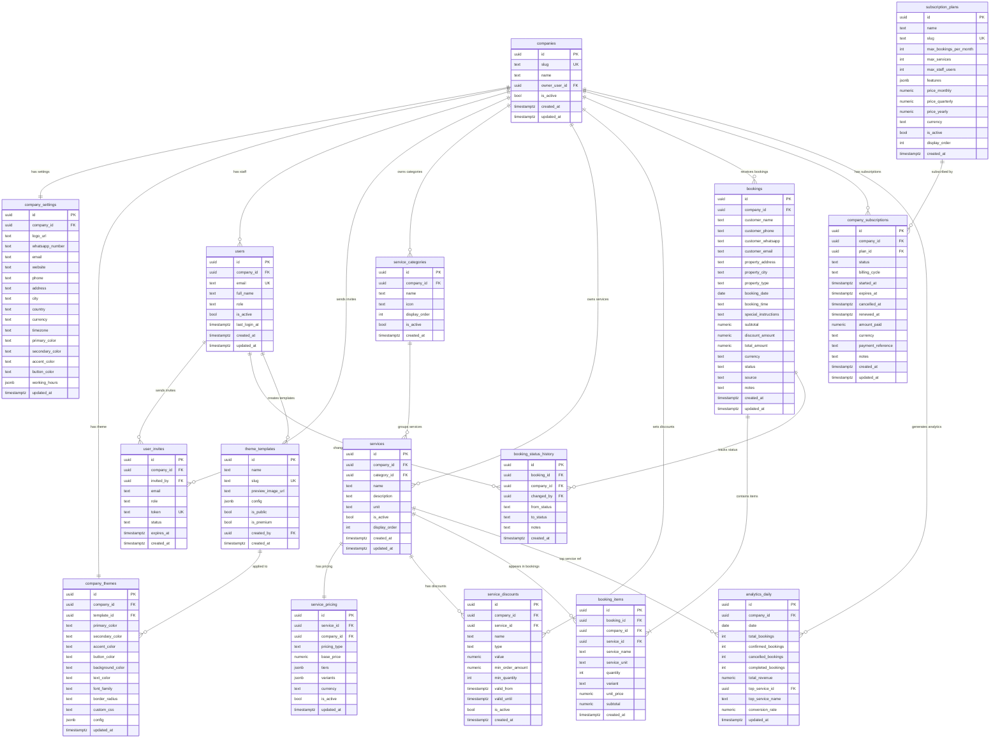

# CleanerX — Multi-Tenant SaaS Database Design
**Version:** 2.0  
**Date:** 2026-07-05  
**Architect:** Principal SaaS Database Architect  
**Engine:** PostgreSQL 15 via Supabase  

---

## Table of Contents
1. [Architecture Principles](#1-architecture-principles)
2. [Entity Relationship Diagram](#2-entity-relationship-diagram)
3. [Table Definitions](#3-table-definitions)
4. [Primary Keys & Foreign Keys Reference](#4-primary-keys--foreign-keys-reference)
5. [Index Recommendations](#5-index-recommendations)
6. [Row Level Security Strategy](#6-row-level-security-strategy)
7. [Migration Strategy from v1](#7-migration-strategy-from-v1)
8. [Migration Folder Structure](#8-migration-folder-structure)

---

## 1. Architecture Principles

### Tenancy Model
**Shared database, shared schema, row-level isolation.**  
Every business table carries a `company_id` foreign key. All access control is enforced at the database level via PostgreSQL Row Level Security (RLS) — the application layer cannot bypass it even with bugs.

### Why this model at scale?
| Scale | Approach | Reason |
|---|---|---|
| 1 – 1,000 companies | Shared schema + RLS | Simple ops, cheap, instant onboarding |
| 1,000 – 10,000 companies | Shared schema + RLS | Postgres partitioning on `company_id` if needed |
| 10,000+ companies | Schema-per-tenant sharding | Migrate only if query latency degrades |

### Table naming convention
All tables use **snake_case** (lowercase). No quoted names — no `"Companies"` style. This is corrected from the v1 schema.

### Timestamp convention
All tables carry `created_at timestamptz DEFAULT now()`.  
All mutable tables additionally carry `updated_at timestamptz DEFAULT now()`, managed by a `set_updated_at()` trigger.

---

## 2. Entity Relationship Diagram



---

## 3. Table Definitions

### Tier 1 — Core Tenant Layer

#### `companies`
The tenant registry. One row per cleaning company on the platform.

| Column | Type | Constraints | Notes |
|--------|------|-------------|-------|
| id | uuid | PK, DEFAULT gen_random_uuid() | Surrogate key |
| slug | text | UNIQUE NOT NULL | URL key, e.g. `sparkle-clean`. Used in `/book/[slug]` |
| name | text | NOT NULL | Display name |
| owner_user_id | uuid | FK → users(id) | Set after first user created |
| is_active | bool | DEFAULT true | Platform can suspend without deleting |
| created_at | timestamptz | DEFAULT now() | |
| updated_at | timestamptz | DEFAULT now() | Trigger-managed |

---

#### `company_settings`
One-to-one with companies. Holds all configurable brand and contact fields.

| Column | Type | Notes |
|--------|------|-------|
| id | uuid | PK |
| company_id | uuid | FK → companies(id) CASCADE, UNIQUE |
| logo_url | text | Full URL to hosted image |
| favicon_url | text | Browser tab icon |
| whatsapp_number | text | E.164 format, e.g. `+923279959900` |
| email | text | Company contact email |
| website | text | Company website URL |
| phone | text | Voice phone number |
| address | text | Full street address |
| city | text | City for display on booking page |
| country | text | DEFAULT `'PK'` |
| currency | text | DEFAULT `'PKR'` — ISO 4217 |
| timezone | text | DEFAULT `'Asia/Karachi'` — IANA format |
| primary_color | text | DEFAULT `'#0A1F44'` |
| secondary_color | text | DEFAULT `'#D4AF37'` |
| accent_color | text | Highlight / CTA hover color |
| button_color | text | Main button background |
| working_hours | jsonb | `{mon:{open:"08:00",close:"18:00"}, sat:{open:"09:00",close:"14:00"}, sun:null}` |
| updated_at | timestamptz | Trigger-managed |

---

#### `users`
All platform users across all companies. Role determines access scope.

| Column | Type | Constraints | Notes |
|--------|------|-------------|-------|
| id | uuid | PK — matches auth.users(id) | Supabase Auth link |
| company_id | uuid | FK → companies(id) SET NULL | NULL only for super_admin |
| email | text | UNIQUE NOT NULL | |
| full_name | text | | |
| role | text | NOT NULL DEFAULT 'company_owner' | `'super_admin'` \| `'company_owner'` \| `'company_staff'` |
| is_active | bool | DEFAULT true | Soft disable without deleting |
| last_login_at | timestamptz | | Updated on auth |
| created_at | timestamptz | DEFAULT now() | |
| updated_at | timestamptz | DEFAULT now() | Trigger-managed |

**Role access matrix:**

| Role | Scope | Can do |
|------|-------|--------|
| super_admin | Platform-wide | All CRUD on all tables |
| company_owner | Own company only | All CRUD on own company's data |
| company_staff | Own company only | Read + limited write (bookings, no settings) |

---

#### `user_invites`
Staff invitation tokens. Expires after 48 hours.

| Column | Type | Notes |
|--------|------|-------|
| id | uuid | PK |
| company_id | uuid | FK → companies(id) CASCADE |
| invited_by | uuid | FK → users(id) SET NULL |
| email | text | NOT NULL |
| role | text | NOT NULL DEFAULT `'company_staff'` |
| token | text | UNIQUE — cryptographically random |
| status | text | `'pending'` \| `'accepted'` \| `'expired'` |
| expires_at | timestamptz | DEFAULT now() + 48h |
| created_at | timestamptz | |

---

### Tier 2 — Services Layer

#### `service_categories`
Logical groupings of services per company (e.g. "Sofa Cleaning", "Room Cleaning").

| Column | Type | Notes |
|--------|------|-------|
| id | uuid | PK |
| company_id | uuid | FK → companies(id) CASCADE |
| name | text | NOT NULL |
| icon | text | Emoji or icon name for booking form |
| display_order | int | DEFAULT 0 — controls sort order in UI |
| is_active | bool | DEFAULT true |
| created_at | timestamptz | |

---

#### `services`
Individual services per company. Each service belongs to a category.

| Column | Type | Notes |
|--------|------|-------|
| id | uuid | PK |
| company_id | uuid | FK → companies(id) CASCADE |
| category_id | uuid | FK → service_categories(id) SET NULL |
| name | text | NOT NULL |
| description | text | Shown on booking form |
| unit | text | `'item'` \| `'sqft'` \| `'room'` \| `'hour'` |
| is_active | bool | DEFAULT true |
| display_order | int | DEFAULT 0 |
| created_at | timestamptz | |
| updated_at | timestamptz | Trigger-managed |

---

#### `service_pricing`
Flexible per-service pricing engine. Replaces hardcoded `lib/pricing.js`.

| Column | Type | Notes |
|--------|------|-------|
| id | uuid | PK |
| service_id | uuid | FK → services(id) CASCADE, UNIQUE |
| company_id | uuid | FK → companies(id) CASCADE |
| pricing_type | text | `'flat'` \| `'tiered'` \| `'per_unit'` \| `'variant'` |
| base_price | numeric(10,2) | Fallback / single-tier price |
| tiers | jsonb | Quantity tiers: `[{min_qty:1,max_qty:9,price:320},{min_qty:10,price:280}]` |
| variants | jsonb | Named variants: `{small:1200,large:1500}` or `{per_sqft:{tier1:25,tier2:23}}` |
| currency | text | DEFAULT `'PKR'` |
| is_active | bool | DEFAULT true |
| updated_at | timestamptz | Trigger-managed |

---

#### `service_discounts`
Discount rules per company. Optionally scoped to a specific service.

| Column | Type | Notes |
|--------|------|-------|
| id | uuid | PK |
| company_id | uuid | FK → companies(id) CASCADE |
| service_id | uuid | FK → services(id) CASCADE — NULL = all services |
| name | text | E.g. "Summer Sale 20%" |
| type | text | `'percentage'` \| `'fixed'` |
| value | numeric(10,2) | Percentage (0–100) or fixed PKR amount |
| min_order_amount | numeric(10,2) | Minimum subtotal to apply |
| min_quantity | int | Minimum quantity to apply |
| valid_from | timestamptz | NULL = always active |
| valid_until | timestamptz | NULL = no expiry |
| is_active | bool | DEFAULT true |
| created_at | timestamptz | |

---

### Tier 3 — Bookings Layer

#### `bookings`
Core booking record. The public booking form inserts here via API route.

| Column | Type | Notes |
|--------|------|-------|
| id | uuid | PK |
| company_id | uuid | FK → companies(id) RESTRICT — never orphan a booking |
| customer_name | text | NOT NULL |
| customer_phone | text | NOT NULL |
| customer_whatsapp | text | May differ from phone |
| customer_email | text | Optional |
| property_address | text | Full property address |
| property_city | text | |
| property_type | text | `'home'` \| `'office'` \| `'villa'` |
| booking_date | date | NOT NULL |
| booking_time | text | E.g. `'09:00 AM'` |
| special_instructions | text | Customer notes |
| subtotal | numeric(10,2) | Before discount |
| discount_amount | numeric(10,2) | DEFAULT 0 |
| total_amount | numeric(10,2) | Final price |
| currency | text | DEFAULT `'PKR'` |
| status | text | `'pending'` \| `'confirmed'` \| `'in_progress'` \| `'completed'` \| `'cancelled'` |
| source | text | `'web'` \| `'whatsapp'` \| `'admin'` — for analytics |
| notes | text | Internal staff notes |
| created_at | timestamptz | |
| updated_at | timestamptz | Trigger-managed |

---

#### `booking_items`
Itemized line items for each booking. Pricing is **snapshotted** — changing service price later does not alter historical bookings.

| Column | Type | Notes |
|--------|------|-------|
| id | uuid | PK |
| booking_id | uuid | FK → bookings(id) CASCADE |
| company_id | uuid | FK → companies(id) RESTRICT — denormalized for RLS efficiency |
| service_id | uuid | FK → services(id) SET NULL — SET NULL if service deleted |
| service_name | text | Snapshot of name at booking time |
| service_unit | text | Snapshot of unit at booking time |
| quantity | int | DEFAULT 1 |
| variant | text | E.g. `'large'`, `'101-300sqft'` |
| unit_price | numeric(10,2) | Snapshotted price per unit |
| subtotal | numeric(10,2) | quantity × unit_price |
| created_at | timestamptz | |

---

#### `booking_status_history`
Immutable audit log of every status change on a booking.

| Column | Type | Notes |
|--------|------|-------|
| id | uuid | PK |
| booking_id | uuid | FK → bookings(id) CASCADE |
| company_id | uuid | FK → companies(id) RESTRICT — for RLS |
| changed_by | uuid | FK → users(id) SET NULL |
| from_status | text | NULL on first record (creation) |
| to_status | text | NOT NULL |
| notes | text | Optional staff note |
| created_at | timestamptz | Immutable — no updated_at |

---

### Tier 4 — Subscription Layer

#### `subscription_plans`
Platform-defined plans. Managed by super_admin only.

| Column | Type | Notes |
|--------|------|-------|
| id | uuid | PK |
| name | text | `'Starter'` \| `'Professional'` \| `'Enterprise'` |
| slug | text | UNIQUE — `'starter'`, `'pro'`, `'enterprise'` |
| max_bookings_per_month | int | NULL = unlimited |
| max_services | int | NULL = unlimited |
| max_staff_users | int | NULL = unlimited |
| features | jsonb | `{theme_studio:true, analytics:true, api_access:false}` |
| price_monthly | numeric(10,2) | In USD |
| price_quarterly | numeric(10,2) | Typically 10% discount |
| price_yearly | numeric(10,2) | Typically 20% discount |
| currency | text | DEFAULT `'USD'` |
| is_active | bool | DEFAULT true |
| display_order | int | Order on pricing page |
| created_at | timestamptz | |

---

#### `company_subscriptions`
One active subscription row per company. Historical rows kept for billing audit.

| Column | Type | Notes |
|--------|------|-------|
| id | uuid | PK |
| company_id | uuid | FK → companies(id) RESTRICT |
| plan_id | uuid | FK → subscription_plans(id) |
| status | text | `'active'` \| `'expired'` \| `'suspended'` \| `'cancelled'` \| `'renewed'` |
| billing_cycle | text | `'monthly'` \| `'quarterly'` \| `'yearly'` |
| started_at | timestamptz | NOT NULL |
| expires_at | timestamptz | NULL = lifetime |
| cancelled_at | timestamptz | |
| renewed_at | timestamptz | |
| amount_paid | numeric(10,2) | Locked at subscription time |
| currency | text | DEFAULT `'USD'` |
| payment_reference | text | Stripe payment intent ID (future) |
| notes | text | |
| created_at | timestamptz | |
| updated_at | timestamptz | Trigger-managed |

---

### Tier 5 — Theme Engine

#### `theme_templates`
Global theme library. Super_admin creates these; companies apply them.

| Column | Type | Notes |
|--------|------|-------|
| id | uuid | PK |
| name | text | `'Classic Navy'`, `'Modern Mint'` |
| slug | text | UNIQUE |
| preview_image_url | text | Thumbnail for theme picker |
| config | jsonb | Full theme config object |
| is_public | bool | DEFAULT true — false = premium marketplace |
| is_premium | bool | DEFAULT false — requires Pro+ plan to unlock |
| created_by | uuid | FK → users(id) SET NULL |
| created_at | timestamptz | |

**Theme config shape:**
```json
{
  "primary_color": "#0A1F44",
  "secondary_color": "#D4AF37",
  "accent_color": "#1E3A6E",
  "button_color": "#D4AF37",
  "background_color": "#FFFFFF",
  "text_color": "#1A1A1A",
  "font_family": "Inter",
  "border_radius": "md",
  "card_shadow": true
}
```

---

#### `company_themes`
Per-company theme. Can start from a template and override individual values.

| Column | Type | Notes |
|--------|------|-------|
| id | uuid | PK |
| company_id | uuid | FK → companies(id) CASCADE, UNIQUE |
| template_id | uuid | FK → theme_templates(id) SET NULL — base template |
| primary_color | text | Overrides template value |
| secondary_color | text | |
| accent_color | text | |
| button_color | text | |
| background_color | text | |
| text_color | text | |
| font_family | text | |
| border_radius | text | `'none'` \| `'sm'` \| `'md'` \| `'lg'` \| `'full'` |
| custom_css | text | Power-user CSS injection (escaped + sanitized by app) |
| config | jsonb | Forward-compatible full config blob |
| updated_at | timestamptz | Trigger-managed |

---

### Tier 6 — Analytics

#### `analytics_daily`
Pre-aggregated daily metrics per company. Written by a database trigger on `bookings` UPDATE and by a scheduled aggregation function. Never written by the application directly.

| Column | Type | Notes |
|--------|------|-------|
| id | uuid | PK |
| company_id | uuid | FK → companies(id) CASCADE |
| date | date | NOT NULL |
| total_bookings | int | DEFAULT 0 |
| confirmed_bookings | int | DEFAULT 0 |
| cancelled_bookings | int | DEFAULT 0 |
| completed_bookings | int | DEFAULT 0 |
| total_revenue | numeric(12,2) | Sum of completed booking total_amounts |
| top_service_id | uuid | FK → services(id) SET NULL |
| top_service_name | text | Denormalized snapshot |
| conversion_rate | numeric(5,2) | confirmed / total × 100 |
| updated_at | timestamptz | Trigger-managed |

**UNIQUE constraint:** `(company_id, date)` — one row per company per day, upserted.

---

## 4. Primary Keys & Foreign Keys Reference

| Table | PK | Foreign Keys |
|---|---|---|
| companies | id | owner_user_id → users(id) |
| company_settings | id | company_id → companies(id) |
| users | id (= auth.users.id) | company_id → companies(id) |
| user_invites | id | company_id → companies(id), invited_by → users(id) |
| service_categories | id | company_id → companies(id) |
| services | id | company_id → companies(id), category_id → service_categories(id) |
| service_pricing | id | service_id → services(id), company_id → companies(id) |
| service_discounts | id | company_id → companies(id), service_id → services(id) |
| bookings | id | company_id → companies(id) |
| booking_items | id | booking_id → bookings(id), company_id → companies(id), service_id → services(id) |
| booking_status_history | id | booking_id → bookings(id), company_id → companies(id), changed_by → users(id) |
| subscription_plans | id | — |
| company_subscriptions | id | company_id → companies(id), plan_id → subscription_plans(id) |
| theme_templates | id | created_by → users(id) |
| company_themes | id | company_id → companies(id), template_id → theme_templates(id) |
| analytics_daily | id | company_id → companies(id), top_service_id → services(id) |

---

## 5. Index Recommendations

### Critical Indexes (required for correctness at any scale)

```sql
-- Tenant lookup for every dashboard query
CREATE INDEX idx_services_company           ON services(company_id);
CREATE INDEX idx_bookings_company           ON bookings(company_id);
CREATE INDEX idx_booking_items_booking      ON booking_items(booking_id);
CREATE INDEX idx_booking_items_company      ON booking_items(company_id);
CREATE INDEX idx_booking_status_booking     ON booking_status_history(booking_id);
CREATE INDEX idx_service_pricing_service    ON service_pricing(service_id);
CREATE INDEX idx_service_categories_company ON service_categories(company_id);
CREATE INDEX idx_service_discounts_company  ON service_discounts(company_id);
CREATE INDEX idx_user_invites_company       ON user_invites(company_id);
CREATE INDEX idx_subscriptions_company      ON company_subscriptions(company_id);
```

### Performance Indexes (required at 1,000+ companies)

```sql
-- Dashboard: filter by status (very common query)
CREATE INDEX idx_bookings_company_status ON bookings(company_id, status);

-- Dashboard: filter by date range
CREATE INDEX idx_bookings_company_date   ON bookings(company_id, booking_date DESC);

-- CRM: customer lookup by phone
CREATE INDEX idx_bookings_customer_phone ON bookings(customer_phone);

-- Active subscription check (runs on every authenticated request)
CREATE INDEX idx_subscriptions_company_status ON company_subscriptions(company_id, status);

-- Analytics: time-series queries
CREATE INDEX idx_analytics_company_date ON analytics_daily(company_id, date DESC);

-- Users by company (staff management)
CREATE INDEX idx_users_company ON users(company_id);
```

### Slug Lookup (critical for booking page — public traffic)

```sql
-- Already covered by UNIQUE constraint which creates a B-tree index
-- companies(slug) — auto-indexed
-- companies(slug) lookup is O(log n) — fast even at 100k companies
```

### Partial Indexes (for common filtered queries)

```sql
-- Active bookings only
CREATE INDEX idx_bookings_active ON bookings(company_id, booking_date)
  WHERE status NOT IN ('completed', 'cancelled');

-- Active services only
CREATE INDEX idx_services_active ON services(company_id, display_order)
  WHERE is_active = true;

-- Valid discounts only
CREATE INDEX idx_discounts_active ON service_discounts(company_id)
  WHERE is_active = true AND (valid_until IS NULL OR valid_until > now());
```

---

## 6. Row Level Security Strategy

### Helper Functions (defined in `sql/functions/auth_helpers.sql`)

```sql
-- Returns the company_id of the currently authenticated user
CREATE FUNCTION auth_company_id() RETURNS uuid

-- Returns true if current user is super_admin
CREATE FUNCTION is_super_admin() RETURNS boolean

-- Returns true if current user is company_owner or super_admin
CREATE FUNCTION is_company_admin() RETURNS boolean
```

### RLS Policy Matrix

| Table | Public (anon) | company_staff | company_owner | super_admin |
|---|---|---|---|---|
| companies | — | SELECT own | SELECT/UPDATE own | ALL |
| company_settings | SELECT (via slug) | SELECT own | ALL | ALL |
| users | — | SELECT own | SELECT/INSERT/UPDATE own company | ALL |
| user_invites | — | — | ALL own company | ALL |
| service_categories | SELECT (active) | SELECT own | ALL | ALL |
| services | SELECT (active) | SELECT own | ALL | ALL |
| service_pricing | SELECT (active) | SELECT own | ALL | ALL |
| service_discounts | SELECT (active) | SELECT own | ALL | ALL |
| bookings | INSERT only | SELECT/UPDATE own | ALL own | ALL |
| booking_items | INSERT only | SELECT own | ALL own | ALL |
| booking_status_history | — | SELECT own | ALL own | ALL |
| subscription_plans | SELECT | SELECT | SELECT | ALL |
| company_subscriptions | — | — | SELECT own | ALL |
| theme_templates | SELECT (public) | SELECT | SELECT | ALL |
| company_themes | SELECT (for booking page) | SELECT own | ALL | ALL |
| analytics_daily | — | SELECT own | SELECT own | ALL |

### Key Principle: Public Booking INSERT

The booking form at `/book/[slug]` is anonymous (no login required). Bookings are inserted via a server-side Next.js API route using the **service role key** which bypasses RLS. The API route validates the slug, resolves the `company_id` server-side, then inserts with the correct `company_id` set explicitly. The anon user never touches the DB directly.

---

## 7. Migration Strategy from v1

### What exists in v1 (legacy tables with quoted names)

```
"Companies"   → 6 columns, no slug, no theme fields
"Users"       → role is 'admin'|'customer' only
"Services"    → no company_id
"Bookings"    → no company_id, service stored as plain text string
"AuthInvites" → no company_id
```

### Migration approach: Parallel rename + extend

Do NOT drop old tables until verified. Run in this order:

```
Step 1: Create all new v2 tables (with _v2 suffix during transition)
Step 2: Enable RLS on new tables
Step 3: Migrate data (see migration/009_data_migration.sql)
Step 4: Verify data integrity (row counts, spot-check records)
Step 5: Update application to point to new table names
Step 6: Drop old tables (after 1-2 week stabilization period)
```

### Data mapping

| v1 Table | v2 Table(s) | Transformation |
|---|---|---|
| "Companies" | companies + company_settings | Split into two tables; generate slug from name |
| "Users" | users | Rename role 'admin' → 'company_owner'; add is_active |
| "Services" | services + service_pricing | service requires company_id; price moves to service_pricing |
| "Bookings" | bookings + booking_items | service (text) → booking_items rows; add company_id |
| "AuthInvites" | user_invites | Add company_id, role, expires_at |

### Risk: Services without company_id

If existing "Services" rows have no `company_id`, they cannot be assigned to a tenant automatically. Resolution: assign all orphaned services to the first company, or prompt super_admin to reassign in the admin panel after migration.

---

## 8. Migration Folder Structure

```
sql/
├── DATABASE_DESIGN.md                   ← This document
│
├── migrations/                          ← Run in numeric order
│   ├── 001_core_tenant_layer.sql        ← companies, company_settings, users, user_invites
│   ├── 002_services_layer.sql           ← service_categories, services, service_pricing, service_discounts
│   ├── 003_bookings_layer.sql           ← bookings, booking_items, booking_status_history
│   ├── 004_subscriptions.sql            ← subscription_plans, company_subscriptions
│   ├── 005_theme_engine.sql             ← theme_templates, company_themes
│   ├── 006_analytics.sql                ← analytics_daily + trigger
│   ├── 007_rls_policies.sql             ← ALL RLS enable + policies (run after tables exist)
│   ├── 008_indexes.sql                  ← ALL performance indexes
│   └── 009_data_migration.sql           ← Migrate data from v1 legacy tables
│
├── functions/
│   └── auth_helpers.sql                 ← RLS helper functions (run before 007)
│
├── seeds/
│   ├── subscription_plans.sql           ← Starter, Professional, Enterprise plans
│   └── theme_templates.sql             ← Classic Navy, Modern, Minimal templates
│
└── schema.sql                           ← Legacy v1 schema (kept for reference)
```

### Running order

```bash
# 1. Functions first (used by RLS policies)
psql < sql/functions/auth_helpers.sql

# 2. Tables in dependency order
psql < sql/migrations/001_core_tenant_layer.sql
psql < sql/migrations/002_services_layer.sql
psql < sql/migrations/003_bookings_layer.sql
psql < sql/migrations/004_subscriptions.sql
psql < sql/migrations/005_theme_engine.sql
psql < sql/migrations/006_analytics.sql

# 3. Security layer
psql < sql/migrations/007_rls_policies.sql

# 4. Performance layer
psql < sql/migrations/008_indexes.sql

# 5. Seeds (platform data)
psql < sql/seeds/subscription_plans.sql
psql < sql/seeds/theme_templates.sql

# 6. Data migration (only if migrating from v1)
psql < sql/migrations/009_data_migration.sql
```

In Supabase, paste each file's content into **SQL Editor → New query** and run in the same order.

### Post-launch migrations (apply after the initial run above)

```bash
psql < sql/migrations/010_legacy_bookings_rls.sql
psql < sql/migrations/011_company_pricing_rules.sql
psql < sql/migrations/012_company_pricing_defaults_trigger.sql
psql < sql/migrations/013_default_services_seed.sql
psql < sql/migrations/014_company_service_settings.sql
psql < sql/migrations/015_auto_create_user_profile.sql
psql < sql/migrations/016_company_branding_profile.sql
psql < sql/migrations/017_bookings_cascade_delete.sql
```

**017** changes `bookings.company_id`, `booking_items.company_id`, and
`booking_status_history.company_id` from `ON DELETE RESTRICT` to
`ON DELETE CASCADE`, so deleting a company from the Super Admin panel
(`pages/admin/companies.js`) no longer fails with
`update or delete on table "companies" violates foreign key constraint
"bookings_company_id_fkey"`. It does not change any other tenant
relationship (services, staff, subscriptions, theme, analytics all keep
their existing behavior). Verified against a local schema replica: a
test company with bookings/items/status-history deletes cleanly, its
rows cascade away, and an unrelated second company's rows are
untouched — see the comments at the bottom of the migration file for
the exact verification queries to re-run against the real Supabase
project.
